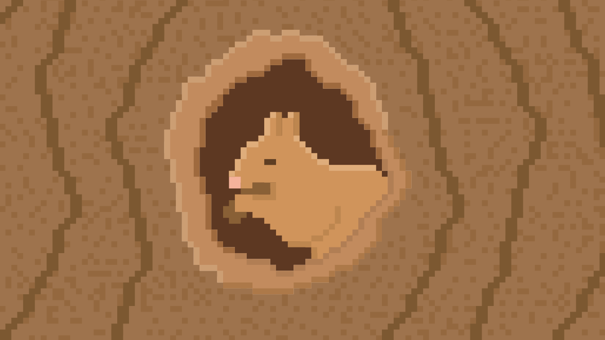
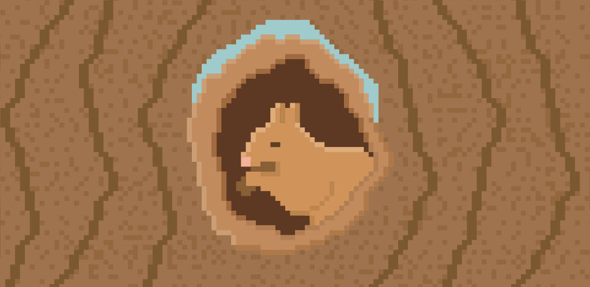
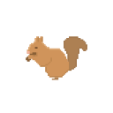

# Branding

This document defines the official visual assets and usage guidelines for Teyin.

---

## Header

Standard header image for social previews and repository sharing.

---

## Header (TV)

Optimized for TV and wide-screen displays.

## Feature Graphic

Feature graphic on f-droid.

---

## Icon

### Foreground (Fill)

Primary icon version using solid fill.

---

### Foreground (Negative)

The negative variant can be used with any background color.  
For demonstration purposes, green is used to showcase visibility in both light and dark markdown
previews.

---

### Icon Outline

Outline variant for minimal or subtle UI contexts.

---

## Icon Background

`#544880`

Primary background color used behind the icon when needed.

---

## Usage Notes

- Do not distort, rotate, or alter the proportions of the assets.
- Maintain sufficient contrast between the icon and its background.
- Prefer the fill version for primary branding and the negative/outline versions for contextual use.

---

[Go Back To Readme](../readme.md)