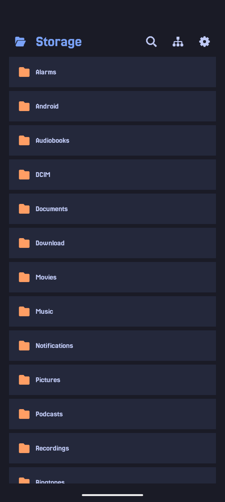
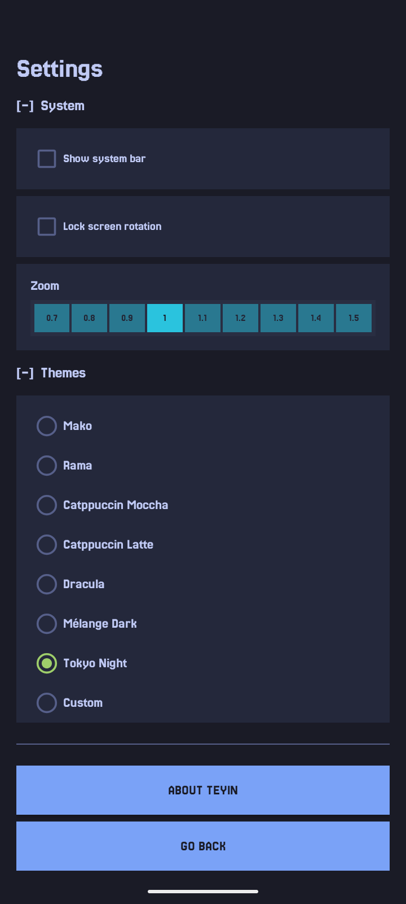
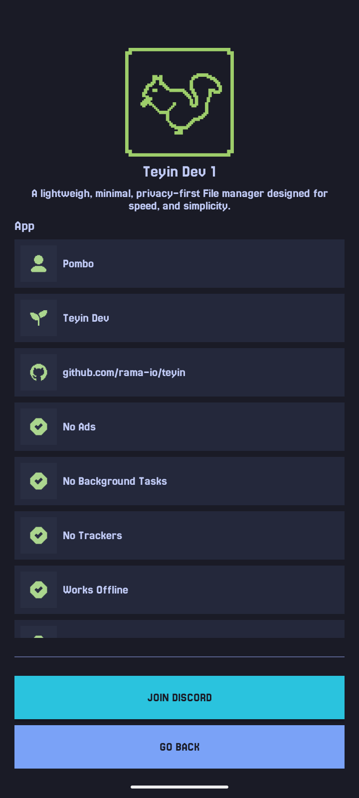

# Teyin

**Teyin** is a **lightweigh, minimal, privacy-first File manager** designed for speed, and
simplicity.

Built entirely in **native Kotlin**, Teyin runs fully **on-device** and avoids tracking.

---

## Screenshots

| Home | Settings | About |
| - | - | - |
|  |  |  |

---

## Permissions

Teyin requires only the permissions necessary to manage your files:

| Permission | Required on | Why |
| --- | --- | --- |
| `READ_EXTERNAL_STORAGE` | API ≤ 29 | Read files and directories on internal storage and SD card |
| `WRITE_EXTERNAL_STORAGE` | API ≤ 29 | Write, move, rename, and delete files on internal storage and SD card |
| `MANAGE_EXTERNAL_STORAGE` | API 30+ | Broad storage access on Android 11+, where the legacy read/write permissions no longer apply (required to browse and manage all files outside of app-specific directories) |

No network access is required.

---

## Features

| Feature | Description |
| --- | --- |
| **Browse & navigate** | Navigate your internal storage and SD card with a clean, fast file browser |
| **SD card write access** | Full read/write support for external storage via Storage Access Framework (Android 6+) |
| **File operations** | Copy, cut, paste, rename, move, and delete files and folders |
| **Multi-select** | Select multiple files at once for batch operations |
| **Bookmarks** | Save and quickly jump to your favourite directories from the side panel |
| **Themes** | Light and dark theme support |
| **Privacy-first** | Fully on-device. no network access, no telemetry, no tracking |

---

## Installation

- Available on **[F-Droid](https://f-droid.org/app/com.rama.teyin)** for easy installation and updates.
- Download the latest APK from the **[Releases page](https://github.com/rama-io/teyin/releases)** or use **[Obtanium](https://github.com/ImranR98/Obtainium)** to get the newest version directly
  from the github releases.

## License

**Teyin** is Free Software. You are free to use, study, share, and improve it under the terms of the
**GNU General Public License v3** or later.

---

## Documents

- [Branding](./docs/branding.md)
- [Attributions](./docs/attributions.md)